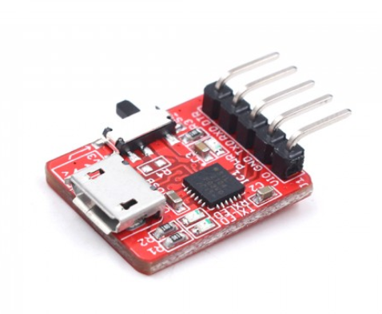
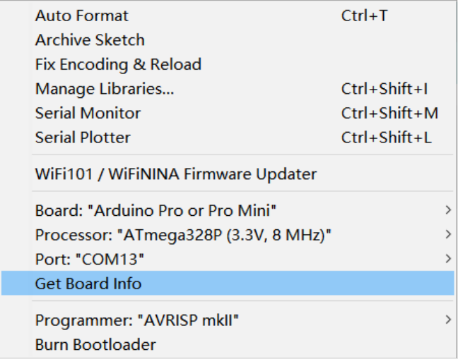
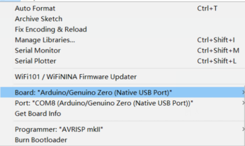
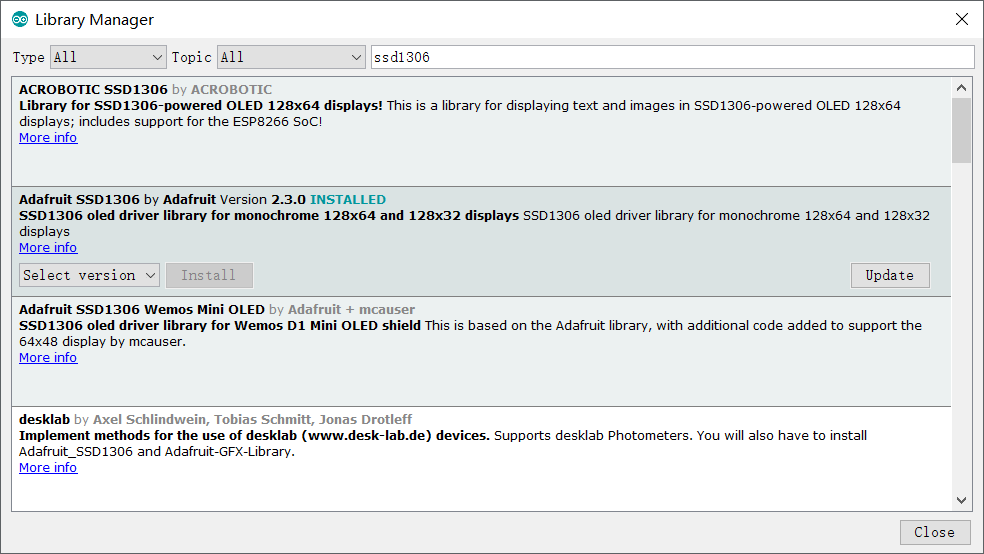
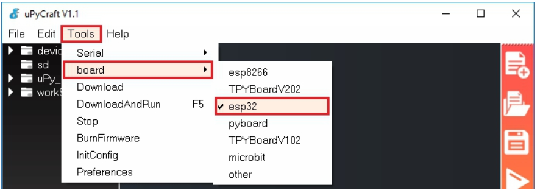
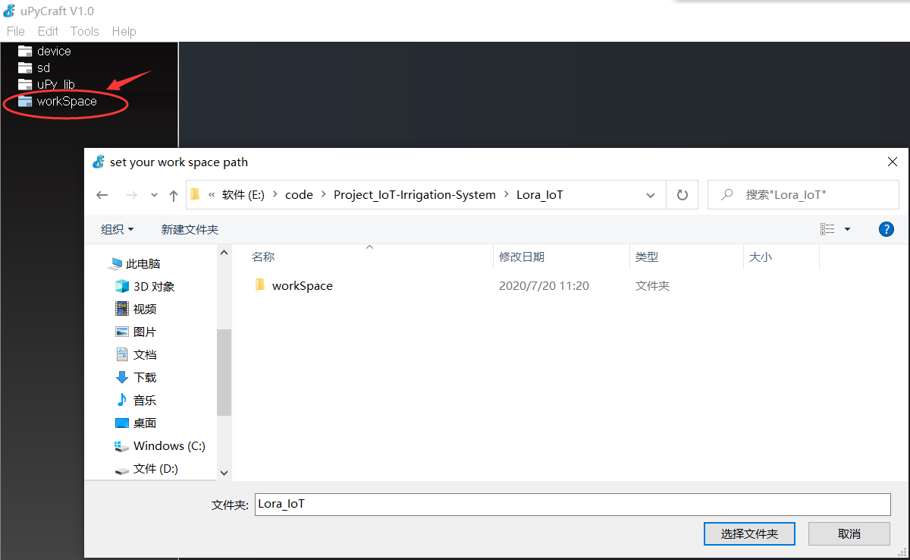
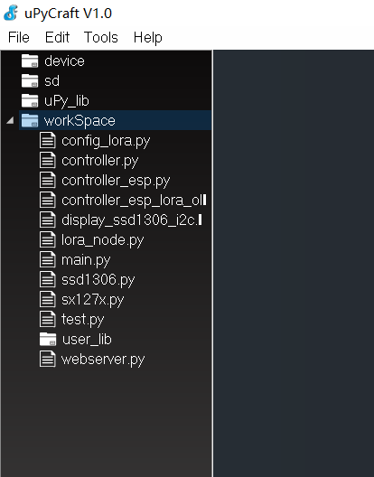
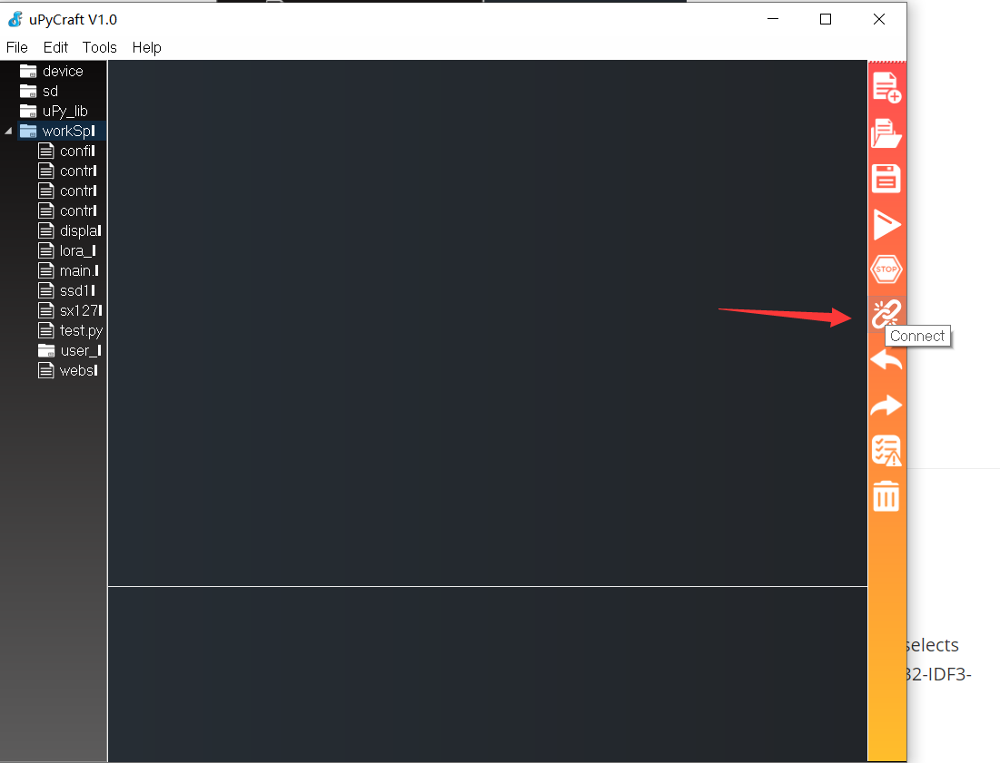
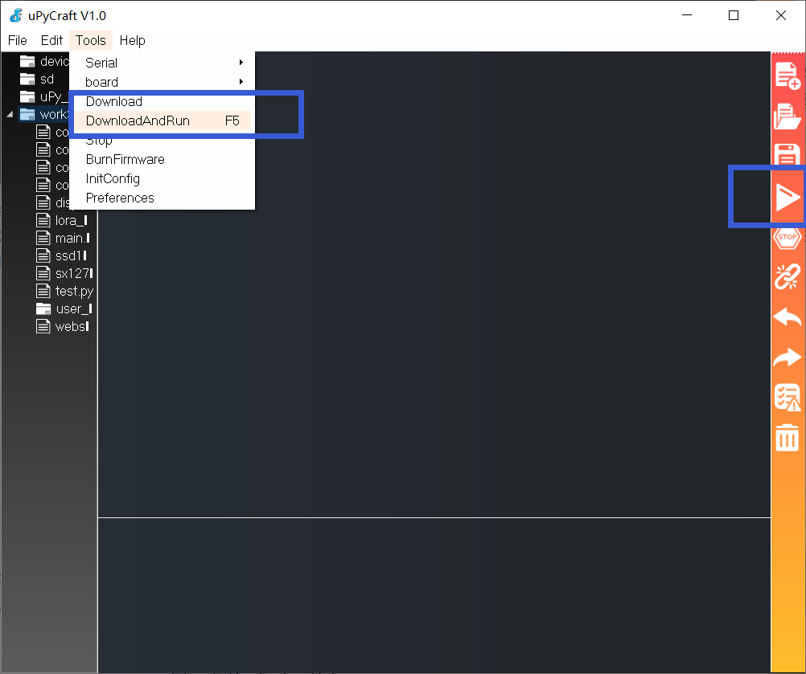

# Makerfabs FAQ

```c++
/*
Version:		V1.1
Author:			Vincent
Create Date:	2020/7/21
Note：
2020/7/23 V1.1: Added maduino and Makepython methods for downloading programs.
*/
```

[toc]

# Overview

Makerfabs has two main product lines, the Makepython series based on ESP32 and the Arduino-based Maduino series.This FAQ mainly explains how to do code burning for different modules, the simple configuration of the IDE.It also explains some development points caused by hardware inconsistencies, such as pin Settings.


# Maduino


Maduino is arduino based modification, including Zero, Pro Mini, etc., most of which are 3.3V. See the Wiki for more information. Support for Arduino IDE.

## Type

### Arduino Pro Mini

#### With Micro USB

- Maduino Lora Radio (433M/868M)


#### Without micro USB

- Lora Soil Moisture Sensor


### Arduino Zero

- Maduino Zero A9G


### Arduino Shield

- WiFi Shield

### With Micro USB

USB integrated CP2104 or other types of serial port chips, no additional converter, directly through the USB cable to connect the serial port.It is used in the same way as the standard Arduino.


### Without Micro USB

There is no USB socket or integrated serial port chip on some modules.But there are serial ports: VCC, GND, RX, TX, DTR.There are two ways to connect a serial port.

#### Makerfabs CP2104 USB2UART

Product link : [CP2104 USB2UART](https://www.makerfabs.com/cp2104-usb-to-serial-converter.html)



This CP2104 USB to Serial Converter is super tiny, a highly-integrated USB-to-UART Bridge Controller providing a simple solution for updating and programming.

The serial port module has the same pin position as the makerfabs module with no USB port.So just plug it into the hole.


The usage of usb cable is the same after that.

#### CP2102 MODULES USB TO TTL

There are many common usb serial port modules on the market, which are basically connected in a common way.

| Makerfabs | USB To TTL |
| --------- | ---------- |
| VCC       | 3.3V       |
| GND       | GND        |
| RX        | TXD        |
| TX        | RXD        |


## Arduino IDE

### Arduino Pro Mini

Arduino Pro Mini is an Arduino IDE supported by default.

- Select "Tools", select "Board" Arduino Pro or Pro min, select processor ATmega328p 3.3V 8MHz, and select corresponding serial port.



- If there is no port to display, you need to download the USB driver. [CP210x driver](https://www.silabs.com/products/development-tools/software/usb-to-uart-bridge-vcp-drivers)

### Arduino Zero

Arduino Zero is the development board of Arduino ARM series.Additional installation is required.

- Open Boards Manager as the screen snap below. And search “arduino zero” and install it.


- Select "Tools", select board -> Arduino/Genuino Zero(Native USB Port).




- If there is no port to display, you need to download the USB driver. [CP210x driver](https://www.silabs.com/products/development-tools/software/usb-to-uart-bridge-vcp-drivers)

## Arduino Upload

Just like normal arduino. 

- Push Upload.


## Install the library

### Arduino Manager

Arduino has its own library manager, and for some authenticated third-party libraries, it can be searched in the library manager.Click install.Common libraries such as SSD1306.

- Select "Tools", select "Manage Libraries"

- Search libraries which you nedd.



### Zip Library

Some of the libraries downloaded manually or provided with the project will come with a ZIP archive.You can add it through the capabilities of the Arduino IDE's import ZIP library.

- Select "Skecth", select "Include Library", select "Add ZIP library..."


Or you can just unzip and copy the folder to the Arduino library folder.Usually the location is "C:\Users\yourname\Documents\Arduino\libraries".


# MakePython


MakePython is mainly for ESP32 and ESP8266, which supports development in c++ with arduino IDE, and development in micropython with uPyCraft.

ESP32 also supports the Arduino IDE, please refer to ESP32 development environment setup under Arduino.


## Type

### ESP32

- MakePython ESP32
- MakePython ESP32 Color LCD

### ESP8266

- MakePython ESP8266


### MakePython Shield

- MakePython Lora


## Arduino IDE

Arduino is supported in Espressif products like ESP32.Manual installation is required.The use method is basically the same as that of Arduino. Please refer to the setting of Maduino for details.

- Select "File", select "preferences".


- Add  url : 

```c++
https://dl.espressif.com/dl/package_esp32_index.json
```

- Open Boards Manager as the screen snap below. And search “esp32” and install it.Just like arudino zero.


## uPyCraft IDE 

- Click this link to download uPyCraft IDE for Windows: : [uPyCraft_win](https://randomnerdtutorials.com/uPyCraftWindows)
- Double-click to open uPyCraft. 


- Select "Tools",select "board", select "esp32" or "esp8266".It depends on the model you're using.



- Select "Tools",select "InitConfig" to reset workspace address.
- Click workSpace, and select the project folder.



- The program files must be placed in the workSpace folder of the project folder.
- Select "File", select "Reflush Directroy".


- The Python files in the folder will be displayed on the left.




## UPyCraft Upload

### ESP32

- Connect MakePython ESP32 to your PC, open uPyCraft, and select connect to the serial port.



- If there is no port to display, you need to download the USB driver. [CP210x driver](https://www.silabs.com/products/development-tools/software/usb-to-uart-bridge-vcp-drivers)

- Firmware will be prompted if it has not been burned before or for other reasons.Board selects ESP32, BURN_addr selects 0x1000, Erase_Flash selects Yes, com selects the port number.Firmware Choose Users, click Choose to Choose ESP32-IDF3-20190125-v1.10.bin.（Or other esp32 micropython bin）


- If you burn the firmware, you need to click connect again.

- Download all python programs in workSpace to ESP32.



- You can also hold down the left mouse button and drag files from the workSpace into Device.


- Press the RST button on ESP32 to reset the development board.

# GPIO/PINS

Some modules have modified the default IO port due to wiring or onboard components.For example, I2C and SPI interfaces are different from standard Arduino and ESP32.

